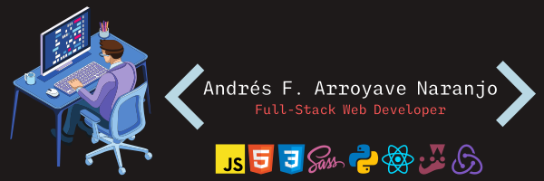

# Hi, I'm Andrés 



##  About me 

[](https://open.spotify.com/user/vjwgoepub5o7x32ocma5lmwnm)

```javascript
  let johnftitor = {
    username: 'JohnFTitor',
    name: 'Andrés Felipe Arroyave Naranjo',
    pronouns: 'he/him',
    stack: ['JavaScript', 'SCSS', 'HTML/CSS', 'Python',
    'React', 'Redux', 'Jest', 'Ruby', 'Ruby on Rails'],
    likes: ['Anime', 'Games', '3D Modeling', 'Drawing',
    'Writing', 'Classical Music'],
    spokenLanguages: ['Spanish', 'English'],
    learning: ['Data Structures/Algorithms', 
    'Japanese', 'Discrete Mathematics', 'TypeScript', 'Angular', 'Django', 'Unity'],
    about: `Full-Stack Web Developer who sees challenges as growth opportunities. 
    Prepared to work efficiently and effectively with diverse international remote teams. 
    Passionate programmer recognized for the ability to grasp new concepts quickly.`
  }
```

##  Some info in what I do 


  <a href="https://github.com/anuraghazra/github-readme-stats" target="_blank"></a>


<a href="https://github.com/anuraghazra/github-readme-stats" target="_blank"></a>


