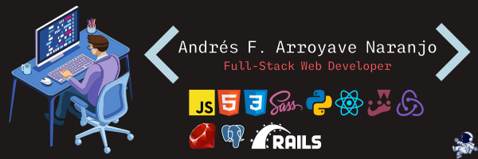

# Hi, I'm Andrés 



##  About me 


[](https://open.spotify.com/user/vjwgoepub5o7x32ocma5lmwnm)

```javascript
  let johnftitor = {
    username: 'JohnFTitor',
    name: 'Andrés Felipe Arroyave Naranjo',
    pronouns: 'he/him',
    stack: ['JavaScript', 'SCSS', 'HTML/CSS', 'Python'],
    likes: ['Anime', 'Games', '3D Modeling', 'Drawing'],
    learning: ['Data Structures/Algorithms', 'APIs'],
    about: `I'm always looking for challenges that help 
    me learn and grow, giving my best in making things 
    happen. Get things done`
  }
```

##  Some info in what I do 


  <a href="https://github.com/anuraghazra/github-readme-stats" target="_blank"></a>


<a href="https://github.com/anuraghazra/github-readme-stats" target="_blank"></a>


